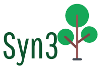

# Syn3



GUI Editor for natural language syntax trees.

You can try it out [here](https://franklevasseur.github.io/syn3/?text=%5BST+%5BSN+Luc%5D+%5BT%27+%5BT+%28pr%C3%A9sent%2C3sg%29%5D+%5BSV+%5BV%27+%5BSN+se%5D+%5BV+demande%5D%5D+%5BSC+%5BSP+o%C3%B9%5D+%5BC%27+%5BC+%CF%95%5D+%5BST+%5BSN+il%5D+%5BT%27+%5BT+%28pr%C3%A9sent%2C3sg%29%5D+%5BSV+%5BV%27+%5BV+a+mis%5D+%5BSN+%5BDet+le%5D+%5BN%27+%5BN+chat.%5D%5D%5D%5D%5D%5D%5D%5D%5D%5D%5D%5D).

To see the project's roadmap, check out the [todo.md](./todo.md) file.

## Usage

### Requirements

- Node.js v16.15.1 (you can use [nvm](https://github.com/nvm-sh/nvm))
- Yarn (npm i -g yarn)

### Installation

```bash
git clone git@github.com:franklevasseur/syn3.git
cd syn3
yarn
yarn build
yarn start
```
